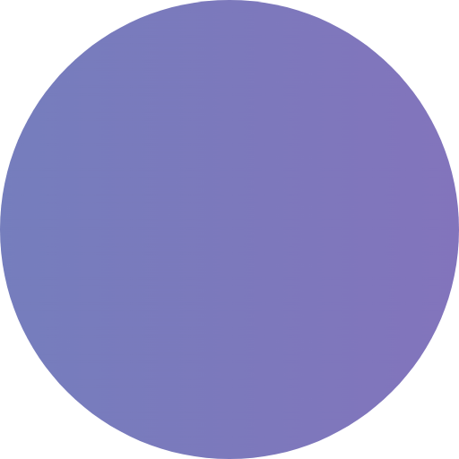

<a name="readme-top"></a>

<!--
Here's a blank template to get started: To avoid retyping too much info. Do a search and replace with your text editor for the following: `Tailwind-Animations`, `twitter_handle`, `Tailwind Animations`, `Beautiful Tailwind animations for your app in seconds`
-->

<!-- PROJECT SHIELDS -->
<!--
*** I'm using markdown "reference style" links for readability.
*** Reference links are enclosed in brackets [ ] instead of parentheses ( ).
*** See the bottom of this document for the declaration of the reference variables
*** for contributors-url, forks-url, etc. This is an optional, concise syntax you may use.
*** https://www.markdownguide.org/basic-syntax/#reference-style-links
-->

[![Contributors][contributors-shield]][contributors-url]
[![Forks][forks-shield]][forks-url]
[![Stargazers][stars-shield]][stars-url]
[![Issues][issues-shield]][issues-url]
[![MIT License][license-shield]][license-url]
[![LinkedIn][linkedin-shield]][linkedin-url]

<!-- PROJECT LOGO -->
<br />
<div align="center">
  <a href="https://github.com/lorenzopalaia/Tailwind-Animations">
    
  </a>

<h3 align="center">Tailwind Animations</h3>

  <p align="center">
    Beautiful Tailwind animations for your app in seconds
    <br />
    <a href="https://github.com/lorenzopalaia/Tailwind-Animations"><strong>Explore the docs »</strong></a>
    <br />
    <br />
    <a href="https://github.com/lorenzopalaia/Tailwind-Animations">View Demo</a>
    ·
    <a href="https://github.com/lorenzopalaia/Tailwind-Animations/issues">Report Bug</a>
    ·
    <a href="https://github.com/lorenzopalaia/Tailwind-Animations/issues">Request Feature</a>
  </p>
</div>

<!-- TABLE OF CONTENTS -->
<!--
<details>
  <summary>Table of Contents</summary>
  <ol>
    <li>
      <a href="#about-the-project">About The Project</a>
      <ul>
        <li><a href="#built-with">Built With</a></li>
      </ul>
    </li>
    <li>
      <a href="#getting-started">Getting Started</a>
      <ul>
        <li><a href="#prerequisites">Prerequisites</a></li>
        <li><a href="#installation">Installation</a></li>
      </ul>
    </li>
    <li><a href="#usage">Usage</a></li>
    <li><a href="#roadmap">Roadmap</a></li>
    <li><a href="#contributing">Contributing</a></li>
    <li><a href="#license">License</a></li>
    <li><a href="#contact">Contact</a></li>
    <li><a href="#acknowledgments">Acknowledgments</a></li>
  </ol>
</details>
-->

<!-- ABOUT THE PROJECT -->

## About The Project

[![Product Name Preview][product-preview]](https://example.com)

Beautiful Tailwind animations for your app in seconds

<p align="right">(<a href="#readme-top">back to top</a>)</p>

### Built With

[![Node][Node.js]][Node-url]
<br />
[![TailwindCSS][TailwindCSS]][TailwindCSS-url]

<p align="right">(<a href="#readme-top">back to top</a>)</p>

<!-- GETTING STARTED -->

## Getting Started

### Installation

1. Install NPM package:

   ```sh
   npm install @lorenzopalaia/tailwind-animations
   ```

2. Add the plugin to your `tailwind.config.js` file:

   ```js
   plugins: [
    require('@lorenzopalaia/tailwind-animations'),
    ...
   ]
   ```

<p align="right">(<a href="#readme-top">back to top</a>)</p>

<!-- USAGE EXAMPLES -->

## Usage

### Schema

Follow the schema `animation-{name}`, where:

- `name` is the pattern name

For example:

```html
<div class="animate-rainbow-river">...</div>
```

<p align="right">(<a href="#readme-top">back to top</a>)</p>

<!-- ANIMATIONS -->

## Patterns

Here's the full list of available animations.

### Gradients

Perfect for buttons, hover effects & adding a little magic. All gradients have a duration between 2s - 5s and can be customized to taste

`rainbow-river`, `green-swoosh`, `fuzzy-dream`, `misty-fade`, `hazy-twist`, `mystic-aura`, `black-swoosh`, `tranquil-waters`, `diagonal-blaze`, `diagonal-ocean-wave`, `diagonal-purple-dream`, `diagonal-rotating-sun`, `diagonal-galaxy`, `purple-swoosh`, `blurred-swoosh`, `serene-sunset`, `vibrant-sun`, `shifting-triangles`, `mellow-embers`, `vertical-bliss`, `vertical-raindance`, `vertical-azure-wave`, `vertical-sunset-tide`, `vertical-golden-dream`

### Spaces

Perfect for full screen immersive experiences and backdrops (recommended viewing this on desktop)

`blue-galaxy`, `gray-fluff`, `pastel-dream`, `amethyst-midnight`, `golden-horizon`, `rose-blush`, `lavender-dream`, `pink-blossom`, `cosmic-wave`, `glow-next-door`, `ski-haze`

### Classics

Perfect for fun & simple interactivity. Similar to `animate-spin`, `animate-ping`, `animate-pulse`, `animate-bounce` classes from Tailwind.

`wobble`, `melt`, `float`, `breathe`, `squiggle`, `flip-and-spin`, `twist`, `pop`, `scatter`, `morphing-rectangle`

<p align="right">(<a href="#readme-top">back to top</a>)</p>

<!-- CONTRIBUTING -->

## Contributing

Contributions are what make the open source community such an amazing place to learn, inspire, and create. Any contributions you make are **greatly appreciated**.

If you have a suggestion that would make this better, please fork the repo and create a pull request. You can also simply open an issue with the tag "enhancement".
Don't forget to give the project a star! Thanks again!

1. Fork the Project
2. Create your Feature Branch (`git checkout -b feature/AmazingFeature`)
3. Commit your Changes (`git commit -m 'Add some AmazingFeature'`)
4. Push to the Branch (`git push origin feature/AmazingFeature`)
5. Open a Pull Request

<p align="right">(<a href="#readme-top">back to top</a>)</p>

<!-- LICENSE -->

## License

Distributed under the MIT License. See `LICENSE.txt` for more information.

<p align="right">(<a href="#readme-top">back to top</a>)</p>

<!-- CONTACT -->

## Contact

Lorenzo Palaia <!-- - [@twitter_handle](https://twitter.com/twitter_handle)--> - lorenzopalaia53@gmail.com

Project Link: [https://github.com/lorenzopalaia/Tailwind-Animations](https://github.com/lorenzopalaia/Tailwind-Animations)

<p align="right">(<a href="#readme-top">back to top</a>)</p>

<!-- ACKNOWLEDGMENTS -->
<!--
## Acknowledgments

- []()
- []()
- []()

<p align="right">(<a href="#readme-top">back to top</a>)</p>
-->

<!-- MARKDOWN LINKS & IMAGES -->
<!-- https://www.markdownguide.org/basic-syntax/#reference-style-links -->

[contributors-shield]: https://img.shields.io/github/contributors/lorenzopalaia/Tailwind-Animations.svg?style=for-the-badge
[contributors-url]: https://github.com/lorenzopalaia/Tailwind-Animations/graphs/contributors
[forks-shield]: https://img.shields.io/github/forks/lorenzopalaia/Tailwind-Animations.svg?style=for-the-badge
[forks-url]: https://github.com/lorenzopalaia/Tailwind-Animations/network/members
[stars-shield]: https://img.shields.io/github/stars/lorenzopalaia/Tailwind-Animations.svg?style=for-the-badge
[stars-url]: https://github.com/lorenzopalaia/Tailwind-Animations/stargazers
[issues-shield]: https://img.shields.io/github/issues/lorenzopalaia/Tailwind-Animations.svg?style=for-the-badge
[issues-url]: https://github.com/lorenzopalaia/Tailwind-Animations/issues
[license-shield]: https://img.shields.io/github/license/lorenzopalaia/Tailwind-Animations.svg?style=for-the-badge
[license-url]: https://github.com/lorenzopalaia/Tailwind-Animations/blob/master/LICENSE.txt
[linkedin-shield]: https://img.shields.io/badge/-LinkedIn-black.svg?style=for-the-badge&logo=linkedin&colorB=555
[linkedin-url]: https://linkedin.com/in/lorenzopalaia
[product-preview]: repo_assets/preview.png
[Next.js]: https://img.shields.io/badge/next.js-000000?style=for-the-badge&logo=nextdotjs&logoColor=white
[Next-url]: https://nextjs.org/
[React.js]: https://img.shields.io/badge/React-20232A?style=for-the-badge&logo=react&logoColor=61DAFB
[React-url]: https://reactjs.org/
[Vue.js]: https://img.shields.io/badge/Vue.js-35495E?style=for-the-badge&logo=vuedotjs&logoColor=4FC08D
[Vue-url]: https://vuejs.org/
[Angular.io]: https://img.shields.io/badge/Angular-DD0031?style=for-the-badge&logo=angular&logoColor=white
[Angular-url]: https://angular.io/
[Svelte.dev]: https://img.shields.io/badge/Svelte-4A4A55?style=for-the-badge&logo=svelte&logoColor=FF3E00
[Svelte-url]: https://svelte.dev/
[Laravel.com]: https://img.shields.io/badge/Laravel-FF2D20?style=for-the-badge&logo=laravel&logoColor=white
[Laravel-url]: https://laravel.com
[Bootstrap.com]: https://img.shields.io/badge/Bootstrap-563D7C?style=for-the-badge&logo=bootstrap&logoColor=white
[Bootstrap-url]: https://getbootstrap.com
[JQuery.com]: https://img.shields.io/badge/jQuery-0769AD?style=for-the-badge&logo=jquery&logoColor=white
[JQuery-url]: https://jquery.com
[Node.js]: https://img.shields.io/badge/Node.js-43853D?style=for-the-badge&logo=node.js&logoColor=white
[Node-url]: https://nodejs.org/
[TailwindCSS]: https://img.shields.io/badge/Tailwind_CSS-38B2AC?style=for-the-badge&logo=tailwind-css&logoColor=white
[TailwindCSS-url]: https://tailwindcss.com/
